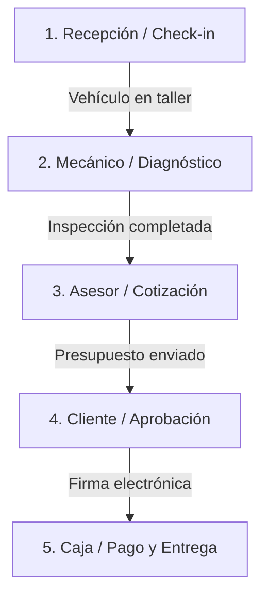

# 📋 Guía de Flujo Operativo para Talleres (SGA)

¡Bienvenido a **SGA — Sistema de Gestión Automotriz**! Esta guía explica de forma sencilla cómo utilizar la plataforma en el día a día de tu taller, desde que ingresa un vehículo hasta que se entrega al cliente completamente pago.

El sistema sigue un **flujo lineal de 5 pasos** diseñado para blindar legalmente al taller, agilizar el diagnóstico y asombrar a tus clientes.

---

---

## 🚪 Paso 1: Recepción del Vehículo (`/reception`)
* **Quién lo hace:** El Recepcionista o Asesor de Servicio.
* **Objetivo:** Registrar el vehículo y crear un "escudo legal" para el taller antes de tocar el auto.

### 📝 Instrucciones:
1. **Datos del auto:** Ingresa la placa (ej: `ABC-123`). Si el auto ya ha visitado el taller antes, aparecerá un botón morado para **auto-completar los datos del cliente** e historial clínico automáticamente.
2. **Motivo de ingreso:** Describe detalladamente qué le pasa al carro según el cliente (ej. *"Chirrido metálico al frenar"*). Esto alimentará la IA de diagnóstico.
3. **Evidencia Visual (Blindaje Legal):** Toma fotos de los 4 lados del auto con tu celular o tablet para registrar abolladuras preexistentes y evitar reclamos falsos de *"este rayón no estaba"*.
4. **Auditoría de Fluidos y Objetos:** Registra el nivel de combustible, kilometraje, si tiene la llave de las llantas de repuesto, y haz el check rápido de niveles de aceite/agua.
5. **Firma de Ingreso:** Pídele al cliente que **firme con su dedo** directamente en la pantalla. Esta firma confirma que los datos y objetos declarados son correctos.
6. **Finalizar:** Presiona "Registrar y Comenzar". El auto entrará automáticamente al Pipeline operativo en estado **"Diagnosis"**.

---

## 🔧 Paso 2: Panel Técnico / Mecánico (`/technician`)
* **Quién lo hace:** El Mecánico o Técnico asignado.
* **Objetivo:** Inspeccionar el auto, reportar fallas y proponer reparaciones.

### 📝 Instrucciones:
1. **Seleccionar auto:** Abre tu panel y selecciona el vehículo que acaba de ingresar.
2. **Inspección de componentes:** Presiona **"Log Item"** para registrar cada falla encontrada.
3. **Clasificación de gravedad:** Define el estado de cada componente:
   * 🟢 **Pass (Pasa):** El componente está en perfecto estado.
   * 🟡 **Recommended (Recomendado):** Desgaste leve. Se sugiere cambiar pronto, pero puede esperar.
   * 🟠 **Fail (Falla):** Necesita reparación o cambio pronto.
   * 🔴 **Critical (Crítico):** Peligro inminente. El auto no debería rodar así (ej: pastillas de freno en el metal).
4. **Evidencia fotográfica:** Sube fotos de las piezas gastadas para que el cliente vea exactamente el daño.
5. **Diagnóstico con IA:** Escribe tus notas técnicas en lenguaje sencillo y presiona el botón de **IA** para estructurar un reporte profesional para el cliente.
6. **Enviar a cotizar:** Una vez inspeccionado todo, presiona **"Submit Diagnosis"**. El auto pasará a estado **"Approval"** para que el asesor le ponga precios.

---

## 💰 Paso 3: Asesor / Cotizador (`/advisor`)
* **Quién lo hace:** El Asesor de Servicio o Jefe de Taller.
* **Objetivo:** Ponerle precio a los repuestos, sumar la mano de obra y enviar la cotización al cliente.

### 📝 Instrucciones:
1. **Seleccionar auto:** En la barra lateral izquierda, verás las órdenes en estado **"Approval"** (esperando cotización). Selecciona una.
2. **Precios de repuestos:** Ingresa el costo de cada repuesto reportado por el mecánico (los componentes marcados en verde "Pass" no tienen costo).
3. **Mano de Obra Global:** Ingresa el costo total del trabajo del mecánico en la casilla **"Global Labor"**.
4. **Generar Cotización:** Presiona **"Generar Cotización"**. El sistema creará un enlace web único e interactivo para este cliente.
5. **Envío al Cliente:** 
   * **WhatsApp:** Presiona "Enviar por WhatsApp" para abrir una conversación con el cliente con un mensaje personalizado y el link directo a su cotización.
   * **Email / PDF:** También puedes descargar el PDF formal o enviárselo por correo directamente desde el panel.

---

## 📱 Paso 4: Portal del Cliente / Aprobación (`/quote/[id]`)
* **Quién lo hace:** El Dueño del Vehículo (en su propio celular).
* **Objetivo:** Revisar el diagnóstico, seleccionar qué autoriza reparar y firmar digitalmente.

### 📝 Instrucciones (Flujo del Cliente):
1. **Abrir enlace:** El cliente abre el link de WhatsApp desde su teléfono.
2. **Revisar Fotos y Notas:** Verá el reporte fotográfico de las fallas críticas de su auto con las explicaciones del mecánico.
3. **Aprobar / Desactivar:** El cliente puede usar los botones interactivos para **desactivar reparaciones opcionales** (ej. decidir cambiar las pastillas de freno críticas hoy, pero posponer el cambio de plumillas de limpiaparabrisas).
4. **Total en vivo:** El monto total se recalcula en tiempo real según lo que el cliente marque o desmarque.
5. **Firma Electrónica:** Al estar de acuerdo, el cliente presiona **"Aceptar Cotización y Firmar Electrónicamente"**.
6. **Notificación al Taller:** Al firmar, el estado del trabajo cambia automáticamente a **"Approved"** en los paneles del taller para que el mecánico inicie las reparaciones autorizadas inmediatamente.

---

## 💵 Paso 5: Caja / Pagos y Entrega (`/advisor/payments`)
* **Quién lo hace:** El Administrador, Cajero o Asesor.
* **Objetivo:** Registrar abonos, saldar cuentas y entregar el vehículo.

### 📝 Instrucciones:
1. **Seleccionar Vehículo Listo:** Cuando el vehículo pasa por reparación y control de calidad (`QC`), llega a la caja en estado **"Listo para Entrega"**.
2. **Ver Saldo:** El sistema te mostrará el monto total aprobado por el cliente y el saldo pendiente.
3. **Registrar Abonos:** Si el cliente hace un abono inicial o paga al final:
   * Escribe el monto recibido.
   * Selecciona el método de pago: **Efectivo 💵, Tarjeta 💳, Transferencia 🏦, o Yape/Plin 📱**.
   * Ingresa el número de referencia de la transacción (opcional).
   * Presiona **"Registrar Pago"**.
4. **Cierre Automático:** Al saldar el 100% de la cuenta, la orden se marcará automáticamente como **"Delivered" (Entregado)** y se cerrará el pipeline.
5. **Recibo de Pago:** Se habilitará un botón para **descargar el Recibo en PDF** con el desglose de los cobros y los abonos registrados para entregárselo al cliente como soporte.
